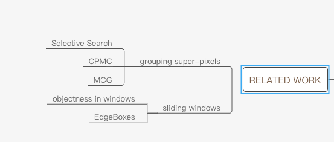

Tips: This kind of network work by using CPU

Faster R-CNN : To unify RPNs with Fast R-CNN

关于RPN和Fast R-CNN 的详细总结

    1.RPN：https://blog.csdn.net/qq_36269513/article/details/80421990
    2.https://www.jianshu.com/p/fbbb21e1e390

